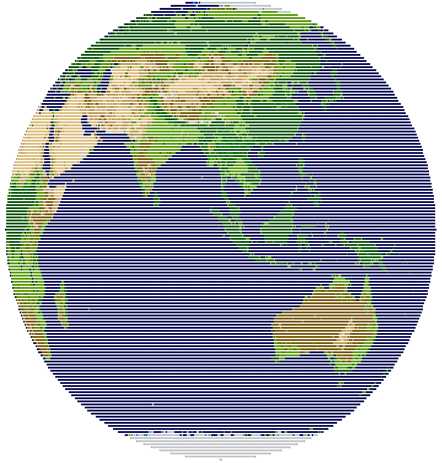
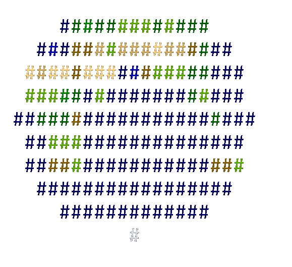
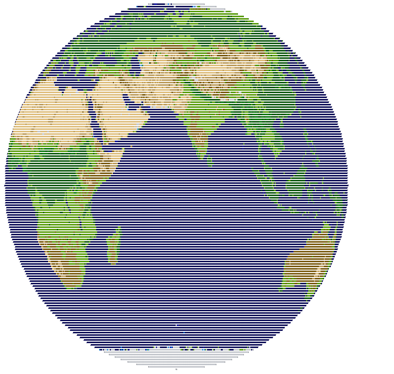
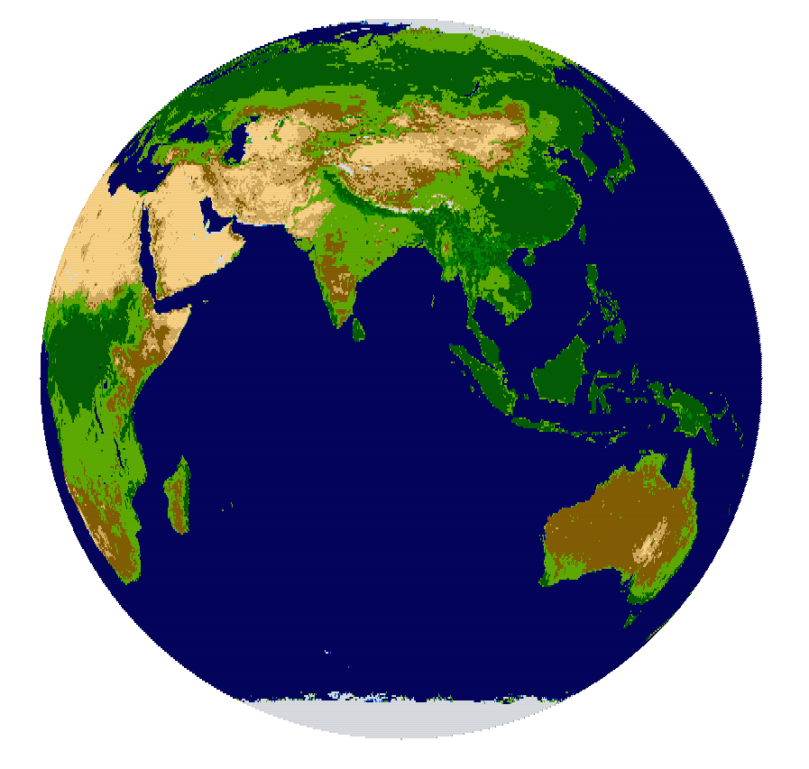

# ASCII 3D Globe in C

A terminal-based 3D Earth renderer written in C that displays a spinning, textured globe using ASCII characters and terminal colors.

<div align="center">
  
</div>

- **Real Earth texture mapping** (from NASA’s Blue Marble collection)
- **Mathematical ray casting** to project a 3D sphere onto a 2D screen
- **Smooth rotation** with configurable speed
- **ANSI color codes** for realistic terrain representation

---

## Features

- 3D math: ray-sphere intersection, 3D rotations, coordinate transformations
- Texture mapping: maps 2D Earth textures onto a 3D sphere surface
- Terrain detection: automatically detects and colors terrain types
- Terminal graphics: real-time rendering with ANSI escape codes and screen buffering
- Performance: double-buffered rendering for smooth animation

---

## Aspect Ratios

The globe shape depends on your terminal size and zoom level.

| Size   | Dimensions | Example Image                                                               |
| ------ | ---------- | --------------------------------------------------------------------------- |
| Small  | 40x10      |    |
| Medium | 700x150    |  |
| Large  | 1600x400   |    |

---

## Requirements

- C compiler (gcc recommended)
- Math library (`-lm` flag)
- [`stb_image.h`](https://raw.githubusercontent.com/nothings/stb/013ac3beddff3dbffafd5177e7972067cd2b5083/stb_image.h) (place it in `src/`)
- Terminal with color and zoom support
- `earth_map.jpg` texture (download [here](https://eoimages.gsfc.nasa.gov/images/imagerecords/57000/57730/land_ocean_ice_2048.jpg))

---

## Quick Start

```bash
# inside the project root
gcc -O3 -o globe src/globe.c -lm
./globe

    Ctrl+C to quit
```

---

## Key Algorithms

- **Ray-Sphere Intersection** – projects screen coordinates to 3D sphere surface
- **Texture Mapping** – converts 3D world coordinates to 2D UV texture coordinates
- **Terrain Classification** – reads RGB values to identify land, ocean, etc.
- **Screen Buffering** – double-buffered animation for smooth rotation

---

## What I Learned

- 3D mathematics and ray-casting
- How texture mapping works under the hood
- Image processing and terrain classification
- Terminal graphics with ANSI escape codes
- Structs, memory management, and organizing C projects

---

## Project Structure

```
Globe/
├── src/
│   ├── globe.c          # Main program
│   └── stb_image.h      # Image loading library
├── assets/
│   ├── images/
│   │   ├── earth_map.jpg        # Earth texture (optional)
│   │   ├── globe-small.png      # Small demo screenshot
│   │   ├── globe-medium.png     # Medium demo screenshot
│   │   └── globe-large.png      # Large demo screenshot
│   └── gifs/
│       └── globe.gif            # Animated demo
└── README.md
```

---

## Notes

- This is a practice project while I’m learning C in my program design class at university.
- The terrain classification is tuned for a specific Earth texture, but it will still run with other images (or even without textures).

---

## License

MIT License – use this in your own projects.
